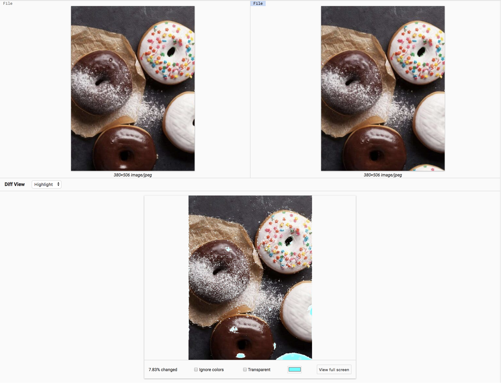
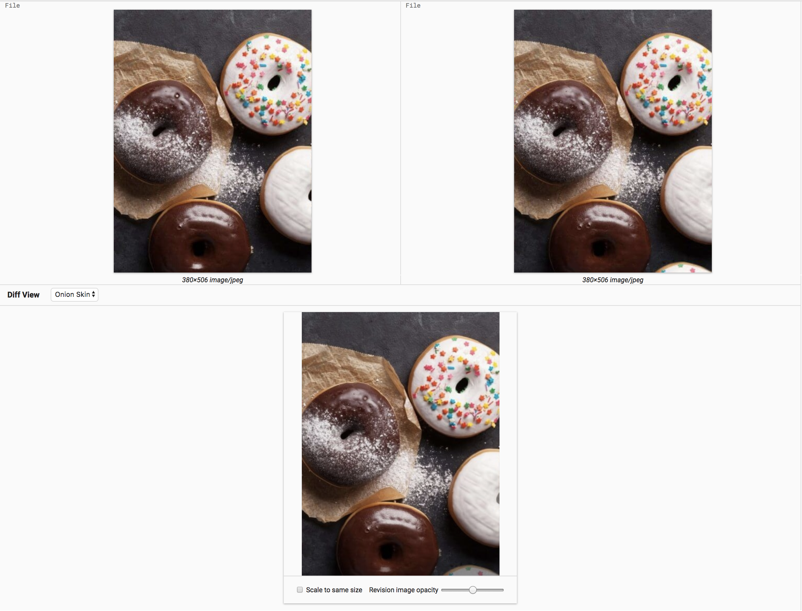

# Image Diff

A plugin that provides a rich image diffing experience in PolyGerrit.
Currently, the plugin features two modes: Highlight Mode and Onion Skin.

## Getting Started

These instructions will get you a copy of the project up and running on your local machine for development and testing purposes. See deployment for notes on how to deploy the project on a live system.

### Prerequisites

[Yarn](https://yarnpkg.com/en/) - Node package manager

### Installing

Use Homebrew to install yarn on macOS:

```
brew install yarn
```

Reference [here](https://yarnpkg.com/en/docs/install#mac-stable) for instruction on how to install on other systems.

Clone the repo and run

```
yarn install
```

to install the dependencies.

## Highlight Mode



This mode uses the [Resemble.JS](https://github.com/HuddleEng/Resemble.js?files=1) (1.2.1) library in its development
The following features are included in this mode:

* Percentage of difference between the images
* Ability to ignore color in the comparison
* Ability to make the diff color more discernible
* Change the diff color
* View the diff in full screen

## Onion Skin



Onion Skin mode is a great way for users to notice changes in the images that might be overlooked when you look at them side by side. By overlaying the new image on top of the old image, the users can change the opacity to see the transition that were made.

The following features are included in this mode:

* Scale the new image to the same size as the old image
* Changing the opacity of the top image

## Testing

This plugin uses [polymer-cli](https://www.polymer-project.org/1.0/docs/tools/polymer-cli#install) to test.

Inside your image-diff repo, run `polymer serve` to start a local web server and open `localhost:8080/test` to view your tests. See [here](https://www.polymer-project.org/2.0/docs/tools/polymer-cli-commands#serve) for more info.

## Development

Reference [here](https://gerrit.googlesource.com/gerrit/+/master/polygerrit-ui/) on how to set up your Gerrit testsite and [here](https://gerrit-documentation.storage.googleapis.com/Documentation/2.15.3/pg-plugin-dev.html#loading) for PolyGerrit plugin development.

## Authors

* [Jack Zheng](https://github.com/JZ987)
* Raeggin Williams
* Kasper Nilsson
